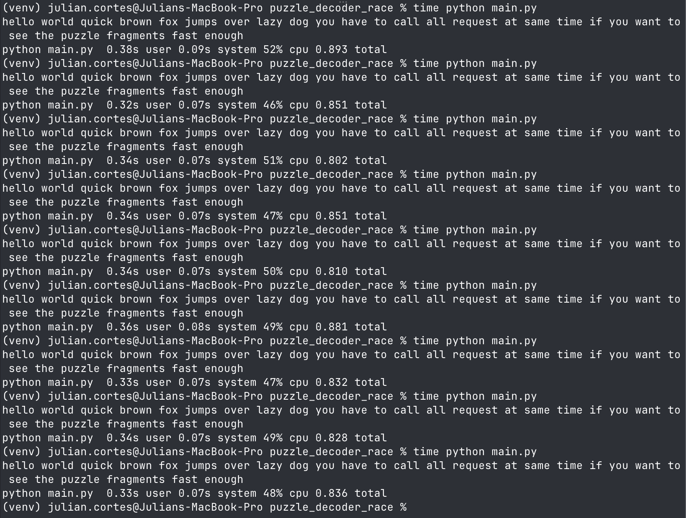

# Puzzle decoder race

Implementation of puzzle decoder race problem.

## Setup

There are two ways to run it:

### Virtual environment

```bash
python3 -m venv venv
source venv/bin/activate
pip install -r requirements.txt
python3 main.py
```

### Docker compose

```bash
docker compose --profile solver up --build --abort-on-container-exit
```

## Running tests

### venv

```bash
docker run -p 8080:8080 ifajardov/puzzle-server
pytest
```

### docker

```bash
docker compose --profile test up --build --abort-on-container-exit
```


## Strategy for speed

The strategy used to get more speed was using build-in asyncio approach due to longest task was waiting for server response (I/O). Puzzle Client launches 30 requests concurrently and the result is ordered by default by ``gather`` method.

## Completion under 1s

There is a integration test (tests/test_integration.py) that hit docker server and assert result is got under 1s. Overall time is around ~842ms



